<!-- README.md is generated from README.Rmd. Please edit that file -->

# Getting started with github, git and R-studio.

<!-- badges: start -->
<!-- badges: end -->

This is a basic tutorial on how to configure, set up, and link github
with RStudio. The end goal of this tutorial is to have you establish a
Github account, install Git, and learn how to get Git working smoothly
in the shell (i.e., terminal, cmd line, etc.) and in the RStudio IDE
(Integrated Development Environment). Whether you decide to use Github
for version control for your projects in RStudio or something else, this
tutorial should help you with integrating Git and Github into your daily
work with R, RMarkdown, and Quarto. This tutorial draws from the more
comprehensive [Happy Git and Github for the
UseR](https://happygitwithr.com/index.html) by [Jennifer
Bryan](https://github.com/jennybc).

This tutorial uses R and RStudio. If you don’t already have those
installed, you will need to install them to your local computer. Follow
the link to [Download R and RStudio
Desktop](https://posit.co/download/rstudio-desktop/).

## Creating a github account

You will need to create a Github account. Let’s do that first.

Go to the github [website](http://github.com) and signup with your email
and password.


Once you have a github site, in the upper left hand corner on your
github site create a **repository** (‘repo’ for short) for where you
want files from your pending project to go. Name the repository whatever
you will be calling your project. Select to have a `README` file where
you can post notes about the project. (once you have established a
working connection between a Github repo and an RStudio project, you’ll
learn how to make a `README.Rmd` file that will automatically sync with
the `README.md` file of your project). Select to make your repository
private while you are working on it (this can be changed later).


Once you hit create you new repository should look something like this:


## Getting started with git on your computer

You will need to have a Git client installed on your local computer
(Follow this link for more detailed instructions
[link](https://happygitwithr.com/install-git.html)).

There are many options to choose from. If you are using `Windows`, an
easy choice is to install [Git for Windows](https://gitforwindows.org/).

If you are using a `macOS`, you have at least three options;

- Option 1: Install the Xcode command line tools (not all of Xcode),
  which includes Git.

Go to the shell/terminal in RStudio and enter this command to elicit an
offer to install developer command line tools:

    xcode-select --install

- Option 2: Install Git from here:
  [website](https://git-scm.com/downloads)

- Option 3: Install [Homebrew](https://brew.sh/) and then run the
  following in the shell/terminal

<!-- -->

    brew install git

Check if you have git installed on your computer. For this you have to
use terminal to check. In your `terminal` write

    git --version

and you should get back your version number.


If you do not have git on your computer you may have to install it. For
instructions on how to check and install git on your computer see this
very helpful
[website](https://jennybc.github.io/2014-05-12-ubc/ubc-r/session03_git.html)
or better yet this [manual](https://happygitwithr.com/index.html)

### Configure Git with your name and Github account email

This part is simply configuring Git with your name and the email
associated with your Github account. You **must** use the same email
that is associated with your Github account. The `user.name` doesn’t
have to be the same as your Github username. You may want to just put
your First Last name.

You can do this in one of two ways. First is by use of the `usethis` R
package;

``` r
# install.packages("usethis")

library(usethis)
use_git_config(user.name = "First Last", user.email = "your_email@example.org")
```

The second way is through the terminal/shell/command line. In the
terminal, run the following commands;

    git config --global user.name 'Jane Doe'
    git config --global user.email 'jane@example.com'
    git config --global --list

## Setting up your creditials with a Personal Access Token (PAT)

> When we interact with a remote Git server, such as GitHub, we have to
> include credentials in the request. This proves we are a specific
> GitHub user, who’s allowed to do whatever we’re asking to do. [PAT for
> HTTPS](https://happygitwithr.com/https-pat.html#https-pat)

It is easier to do this first so that you do not run into issues when
you need to push and pull back-and-forth between RStudio and your Github
repo.

**Step 1** - Make sure you are logged in to your Github account on your
browser.

**Step 2** - Run the following code. After you do, your browser should
pop up on Github on the page where you create a Personal Access Token
(PAT);

``` r
# If not already installed, install these packages
install.packages("devtools", "gitcreds")

usethis::create_github_token()
```

- create the token in Github (in the browser)
- copy the PAT to your clipboard
- Leave the window open for the time being

**Step 3**

- Run this function in the console in RStudio;

``` r

gitcreds::gitcreds_set()
```

- A list of options should present in the console
- The output from the console in RStudio should look something like
  this…

<!-- -->

    > gitcreds::gitcreds_set()

    -> Your current credentials for 'https://github.com':

    protocol: https
    host    : github.com
    username: your_username
    password: <-- hidden -->

    -> What would you like to do?

    1: Abort update with error, and keep the existing credentials
    2: Replace these credentials
    3: See the password / token

    Selection:

Enter ‘2’ in the console and press enter.

- enter in the Personal Access Token from your clipboard (paste in the
  console)
- press enter.

You should be able to push your commits to your Github repo and pull
from the repo down the RStudio project on your local computer now.

## Setting up your project in R studio

Now that you have a github account, a local Git client on your computer,
entered in your name and email to git config, and set your PAT for
two-way communication with Github, you are ready to start working with
git through R studio.

- First, copy the URL for the repository in your Github.
- Click on the green `<> Code` button to see the URL for the repo
- Copy the URL


- Open R-studio and start a new project.
- Choose a project with version control:


- Select the option to clone a repository from git.


- Paste the URL from the Github repo you copied earlier
- The `project directory name` should auto-populate with the same name
  as the Repo in Github
- Under `Create project as a subdirectory of:`, you can choose where the
  directory for this project/repo will be (Recommended that you keep the
  subdirectory on your local computer. You can run into problems if you
  place the project in a subdirectory on a cloud network directory
  (e.g., OneDrive, Dropbox).)

Quick re-cap: What R studio will then do is to clone the repository you
created on github locally on your computer.

So that R-studio knows which github local repository to clone you have
to specify an external url that matches your username and the name of
the new repository that you just created on github (Repository URL).

You also have to specify where your local git files are going to be
located see (Create project as subdirectory of:).


Hit the create button and R studio will create a project that should
look something like this. Notice how the files replicate what is in the
Github repo


In case you run into trouble at this stage - and are not able to connect
your files make sure that your local credentials. To check this you can
run the function `edit_git_config()` from the `usethis` R package. This
will open up your `.gitconfig` file in RStudio. Ensure the email in your
`.gitconfig` file matches the email you used to signup with Github:

``` r

library(usethis)
usethis::edit_git_config()
```

There should be no problems here since you already configured git with
your name and email a few steps back.

If your git, github, and RStudio have no problems communicating you can
set about modifying your local files at will, adding files and changing
them.


Each time you add a new file in your local directory or change it in
some way it will appear in your git tab like so:


- Notice that because I have not modified the README file that was
  imported from github this file does not appear in my git tab.

- Only new files or files that have saved changes will appear in the Git
  tab.

- You don’t have to commit and push all the files from the project on
  your local computer up to your Github repo.

- Anything listed in `.gitignore` will be kept away from Git and Github.

- Also note that Github won’t allow you to push files that are greater
  than a certain size (I think anything greater than 500MB, but I’m not
  sure).

- It may be good practice to store your data and large files in multiple
  places, preferably a cloud server (e.g., OneDrive, Dropbox, Google
  Drive, etc.) in addition to the RStudio project on your local
  computer.

## Commit and Push files to Github Repo

The final step is to commit the changes I have made to my local files to
the github repository. For this purpose I have to commit the files I
want to update (I only commit the files I wish to update) and then I
need to push them to the external repository.

To do this I first select the files that I want to commit. Next I hit
the commit button.


When I hit the commit button another window pops up where I can write
myself notes about the changes I am committing. Write something useful
and brief that explains what you have done or should do next. - Green
signifies what is new and will commit; - Red signifies deletion/changes
made. - Review changes before you click commit


Once I hit commit R-studio knows which local files I want to change in
my external depository. Note that I can work locally and commit many
files and then work on other files and commit them later. **Commit only
commits changes to my files locally.** The last step then is to push all
my locally committed files to my external repository.

From within my project I simply push the green push button in my now
empty git tab and my external repository is updated.


Github then tracks all of the changes in each file and new files added
in each commit while also updating the main file.

This is very nice if you are working on a project - like a website that
you might want to change frequently. You can simply open the project -
make a change to any one part of the project and commit those changes to
github. Imagine, for example, a website where you post new data and
other information as it becomes available.

### Optional: Sync a README.Rmd with README.md

The front face of your Github repo will usually display the `README.md`
for your project. Although this isn’t technically a website, this is
where the source code and files for your project will be housed (hence,
repository). It’s often a good idea to include a description of your
repository, long or short, both for yourself and others who may take
interest (or who you’ve shared the link to your repo).

On this page you can include descriptions, links, examples, code, plots,
images, and even gifs. This is best done by use of a RMarkdown file,
`README.Rmd` that will sync with the `README.md` file upon redering
(i.e., knitting in RStudio). This entire repo screen you’re reading now
was written using this method.

- First, build a `README.Rmd` file
- The `usethis::use_readme_rmd()` function initializes a basic,
  executable README.Rmd ready for you to edit:

``` r
use_readme_rmd()
#> ✔ Writing 'README.Rmd'
#> ✔ Adding '^README\\.Rmd$' to '.Rbuildignore'
#> • Update 'README.Rmd' to include installation instructions.
#> ✔ Writing '.git/hooks/pre-commit'
```

In addition to creating `README.Rmd`, this adds some lines to
`.Rbuildignore`, and creates a Git pre-commit hook to help you keep
`README.Rmd` and `README.md` in sync.

Now you should have a `README.Rmd` file in the working directory of your
project. When you want to update the README on Github (either for your
project, an R package, or just for general information) you must only
edit the README**.Rmd** and **not** the README**.md**. When you render
the `README.Rmd` document file, it is *hooked* to the `README.md` so
that changes in the first will also change in the second. Once you have
edited the `README.Rmd` file to your liking, render the document (i.e.,
knit in RStudio), commit, and then push up to your Github repo. The
front page of your Github repo should reflect your edits in the
`README.Rmd`.


# Exercise

- Install git on your computer

- Create a github account

- Create a version control project in R studio and pull documents from
  the github websit

- Add projects in R studio and upload them to the gihub repository
  (using commit and push)

- Working together in git.

One of the most useful things about github is the ability to work
collaboratively.

## Associating your RStudio with a collaborative project

First, in order to work collaboratively, you may need to associate your
RStudio with a project in GitHub that you did not create. If you created
the project, do the following to add collaborators:

Go on the Github website to Settings \> Manage Access \> Invite a
collaborator.


Your teammate should accept the invite in their email.

Once this is complete, you can use the steps above to associate your
RStuido with the GitHub project.

## Pulling Changes

One important aspect of collaboration in Github is the ability to pull
changes. This allows you to update your code to align with changes
pushed by collaborators.

Using the down arrow button, RStudio goes to the GitHub repo, grabs the
most recent code and brings it into your local editor. (Pulling
regularly is extremely important if you’re collaborating, though if
you’re the only one working on an RStudio project and associated GitHub
repo, you know your local code matches what’s on GitHub so it’s less
important.)

To pull, click the blue down arrow on your Git tab to see if you have
changes to pull. If collaborating, you might run into merge conflicts.

When you pull your project updates to show the changes your collaborator
has made to the project. Look at the dates.


and

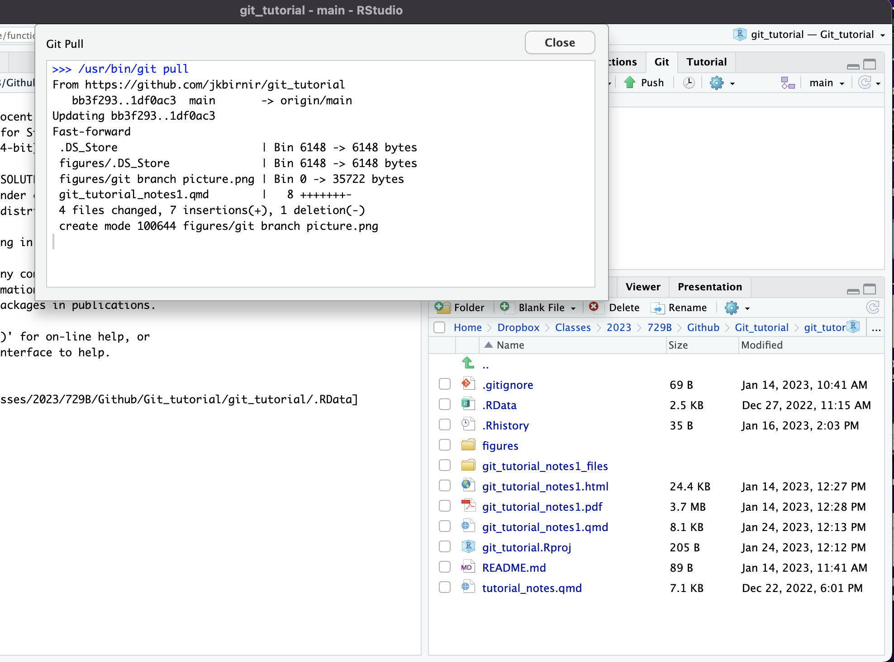 You can also track the changes on github if you want
more details.

Go to your github project:

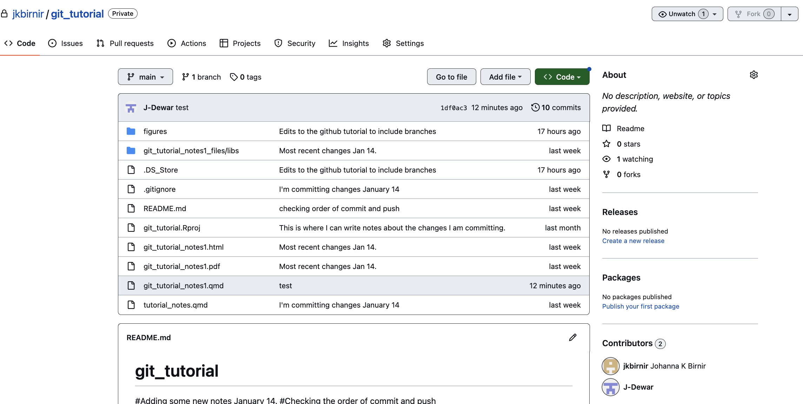 There you see who are the collaborators and when
each item was updated. For even more information click on any of the
files (here the qmd file)

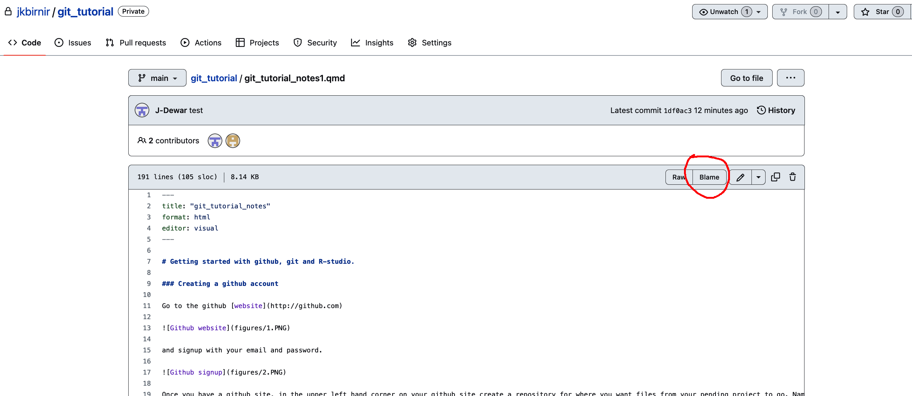 Here you see the history of the development of the
project and if you want to see who made what changes when push the blame
button.

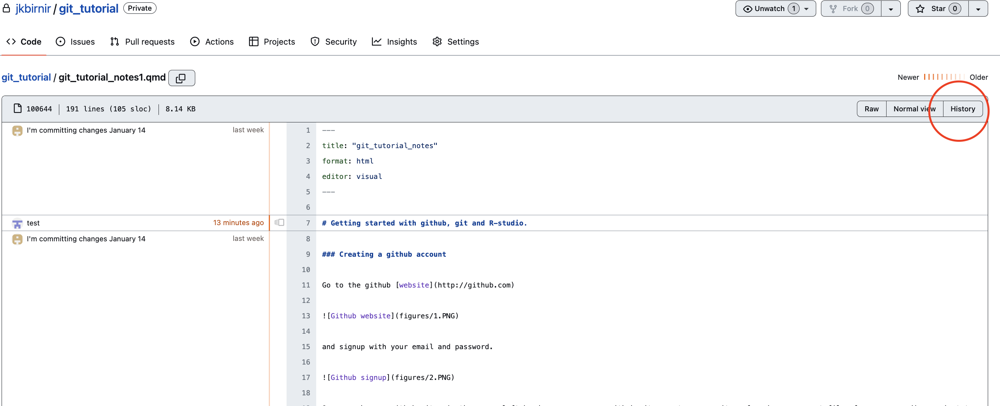 The blame allows you to blame whoever - mostly
yourself ;) is responsible for making changes to your project.

If you want more of an overview - then push the history button and you
get a summary of changes:

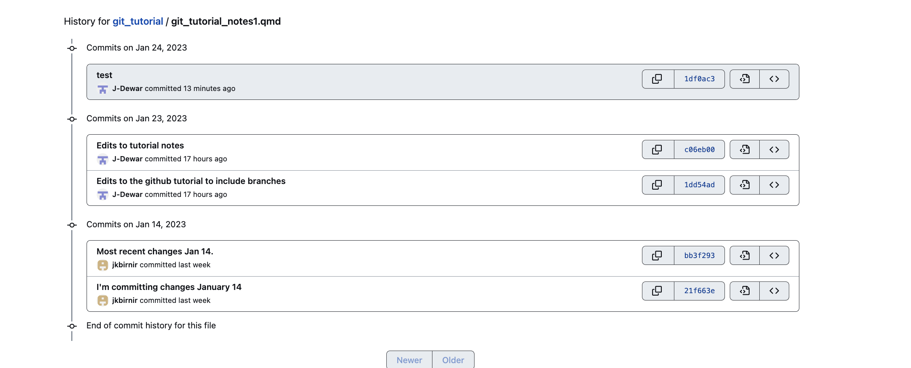 In sum this is the workflow when you and your
collaborator are both working on the main project and either one of you
can make changes to the project.

When someone invites you to a project and to work on the main as here:

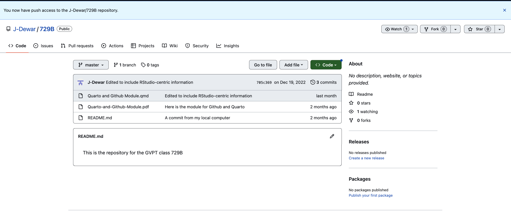

You can open the project locally as you would any other version control
project (see earlier steps in the tutorial)

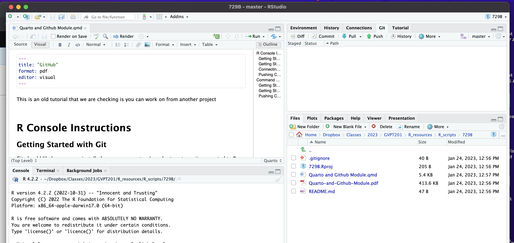

Once you are done changing your files locally - you then go through the
same steps of committing and pushing. Which results in this message
telling you the process was successful.


aand your changes will show up in the remote directory on github.

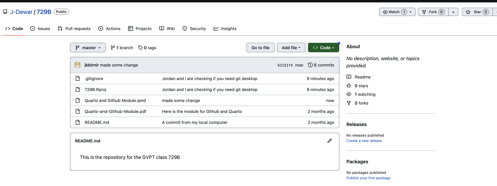

## Branches

Sometimes you have a hierarchy - when one of you is the lead (author for
example, or if you are working with an RA etc). where you want to review
and approve any changes before they are made. In those cases you work
with branches.

In order to create new branches, go to the ‘git’ tab on your RStudio
console and click ‘new branch’.

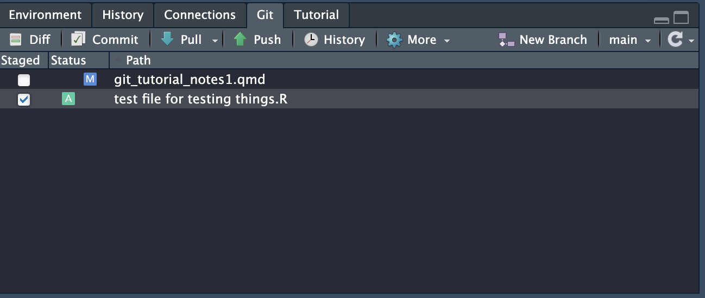

You can then populate that branch the way you want and ask your
associate to work on that branch only (your associate can also create a
branch to be reviewed later)

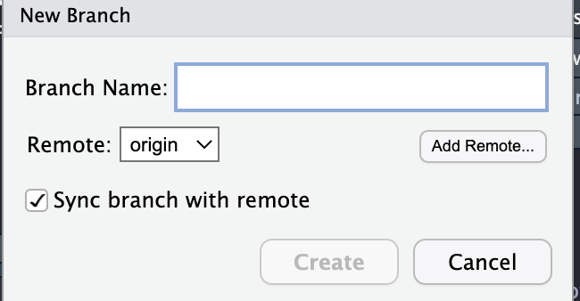

Then click create and you have made the new branch.

You can see your branches like so:

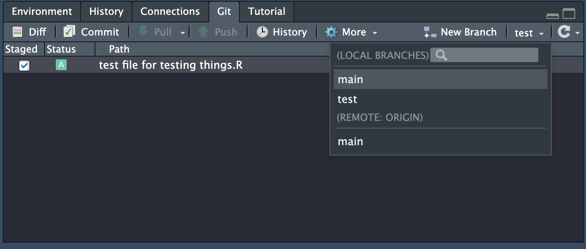

Then simply create the new branch and you’re done.

If you click on the new branch, you will then see this as you switch:

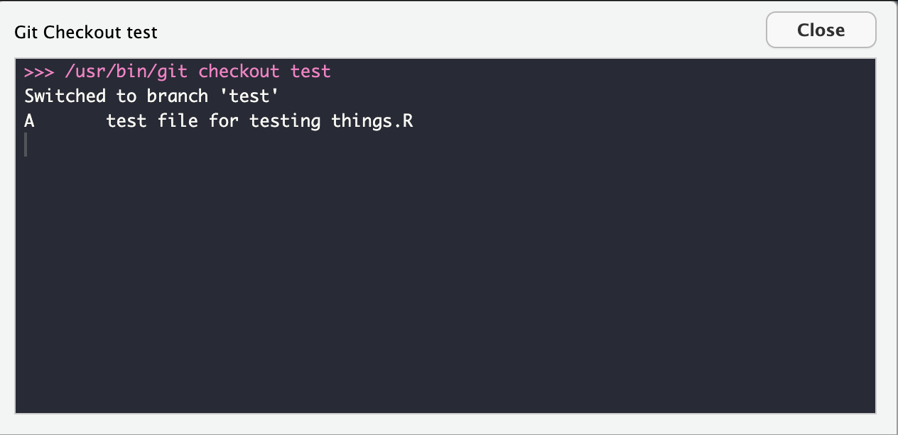

This branch will initially not be published to the repo. You can publish
it via the github website or the github desktop client.

You will then see this on your github page:


# Exercises

### Start a github project on the github website with some documents

### Invite your partner to join

### Pull your partner’s documents,

### Edit the documents, commit the changes and push changes to their project

# Troubleshooting unintended branches

If you try to push when you have not pulled changes that your
collaborator has made on a main branch you get the following message:

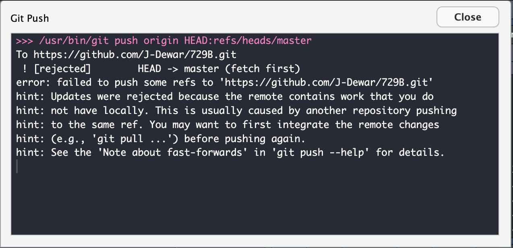

If you try to pull before pushing changes that you have made to
documents that your collaborator has changed you get the following
warning

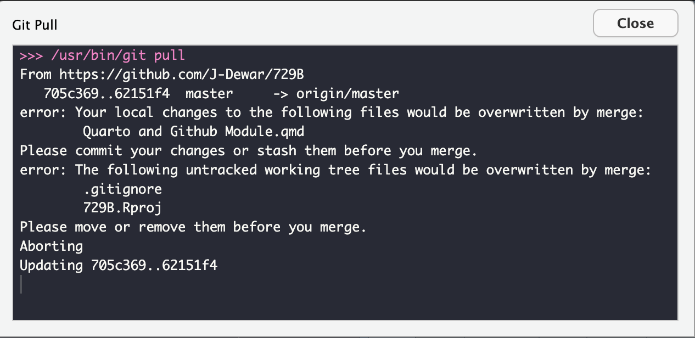

Here the program is creating branches for you so that changes are not
lost. The solution to \#1 is to pull before you start making ay changes
to make sure you are working on the most up to date version. The
solution to \#2 when you both have made changes that need to be
reconciled is to

1)  Committ your local changes then you receive the following message:

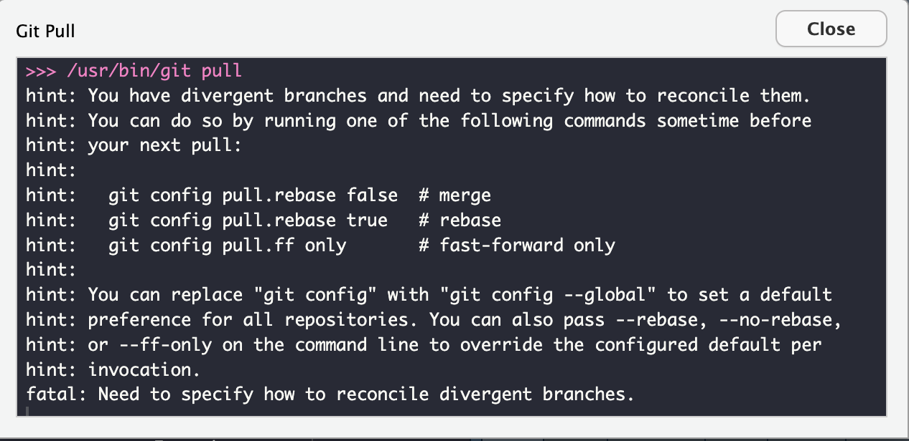

then you pick from the options merge rebase and fast-forward

for a detailed explanation of the differences between the different
options see for example this
[website](https://frontend.turing.edu/lessons/module-3/merge-vs-rebase.html?ads_cmpid=6451354298&ads_adid=76255849919&ads_matchtype=&ads_network=g&ads_creative=517671727591&utm_term=&ads_targetid=dsa-19959388920&utm_campaign=&utm_source=adwords&utm_medium=ppc&ttv=2&gclid=CjwKCAiAoL6eBhA3EiwAXDom5hB7rNI86O5HQq3UFkG9tY7t8uBDicj5fL9lc9K_JCyjvZYKz-Wm-RoC97kQAvD_BwE)

To employ the merge solution go to terminal and write:

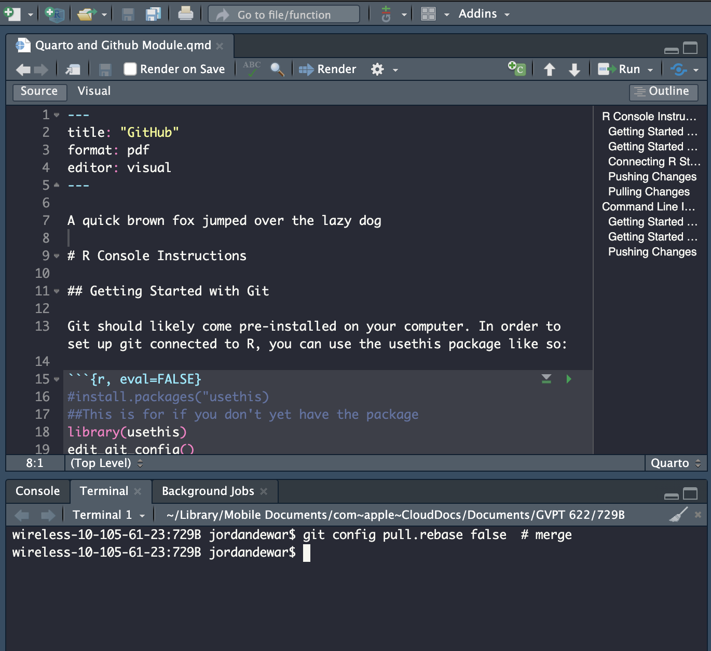

then you can pull the document. Once you pull the document you can
scroll through and see where your merger conflict occurred.

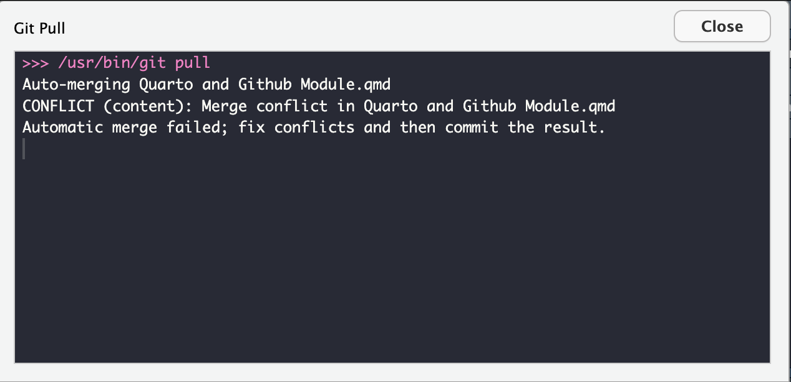

You then have to resolve this conflict save and now you can push.

# Good git hygene

You can look to this
[article](https://betterprogramming.pub/six-rules-for-good-git-hygiene-5006cf9e9e2)
for other useful information for keeping good Git hygiene when
collaborating.

Briefly the first four rules of thumb are:

### **Always Pull Before a Push**

#### **Pull frequently**

#### **Push infrequently**

#### **Commit Frequently**

Additionally the
[article](https://betterprogramming.pub/six-rules-for-good-git-hygiene-5006cf9e9e2)
discusses optimal git branch for working together.

#### **Merge “forward” frequently**

#### **Create Pull Requests Infrequently**

To better understand these

# Associating existing r studio projects with git

In order to associate an existing RStudio project with Git you will need
to create a Git repository as described above and then follow the steps
below.

    #> ✔ Setting active project to 'C:/Users/isaia/Documents/R/git_tutorial'

You will then get a prompt asking if you want to commit the files you’ve
already created to your repo. Select yes (option 1). You should then
also see the git tab.

    #> • Call `gitcreds::gitcreds_set()` to register this token in the local Git credential store
    #>   It is also a great idea to store this token in any password-management software that you use
    #> • Open URL 'https://github.com/settings/tokens/new?scopes=repo,user,gist,workflow&description=DESCRIBE THE TOKEN\'S USE CASE'

You will then get a number of options to select about what your token
use case will be. This will be project-dependent.

You can learn more about the selections
$$here$$(<https://docs.github.com/en/developers/apps/building-oauth-apps/scopes-for-oauth-apps>)
to help guide you in your process.

``` r
#library(gitcreds) 
#gitcreds_set()
```

When prompted to enter a token or password, enter the token you just
created. If you have entered one previously, you will be prompted to
choose if you’d like to keep your credentials. If nothing has changed,
select 1 and keep things as they are. If they have, follow the most
applicable selection.

# Optional: Github Desktop Client

A lot of problems can be resolved by examining the Github desktop
client. It’s free and you can download it from the Github website.
